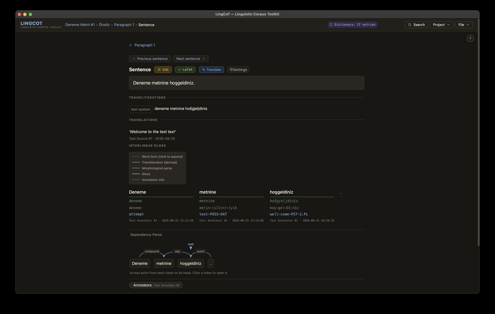

# Linguistic Corpus Toolkit (LingCoT)

**LingCoT is an open-source tool for annotating linguistic corpora.**

**Updated:** 2026-09-23 · **Version:** v3.14.419

> **Status: in development.** No stable release has been cut. The application is
> in daily use on the author's own corpora and the data format is settled enough
> to build on, but interfaces and field names can still change between versions,
> and a change may require you to re-save a corpus. Keep backups of
> `~/LingCoT-Data`, and read the edit log before upgrading if you are mid-project.



*One sentence in the sentence view: its transliteration, a sourced translation,
the interlinear gloss with each tier labelled and each annotation attributed, and
the dependency parse below.*

It is purpose-built for language documentation and linguistic analysis: fieldwork
transcripts, elicited sentences, and texts. It runs offline on your computer,
stores everything as plain-text JSONL that you can read and version-control, and
keeps your data in a local folder outside the application, to protect your
corpora.

### What it does

| | |
|---|---|
| **Interlinear glossing** | the full hierarchy — document, section, paragraph, sentence, word, morpheme — following the Leipzig Glossing Rules |
| **A dictionary that grows with the corpus** | words and morphemes are saved as you annotate, with glosses, definitions, part of speech, allomorphs, semantic domains and pinned examples from the corpus itself |
| **Dependency parsing** | entered by hand in a CoNLL-U-compatible schema, with an arc diagram to read it back |
| **Search with concordance** | text, gloss, transliteration, translation or lemma, at word or sentence level, with concordance and frequency views |
| **Multiple schemes side by side** | transliterations and translations |
| **Annotator tracking** | who annotated what, and when |
| **Export** | interlinear glosses to LaTeX, the dictionary to PDF |
| **Optional machine translation** | Google Translate online, where the sentence is sent to their API — or fully offline with a locally downloaded NLLB-200 model, where no data leaves your computer |

### What it is not

This is not an automatic parser, tagger, or annotator. All analysis is done by
the user, because a parser's assumptions about a language are often wrong or just
unavailable, in fieldwork situations especially. This is a tool for
documentation, analysis, and helping academic and community-oriented linguistic
work and research.

LingCoT runs on Windows, macOS and Linux. It only requires Python 3.9 or later;
setup installs everything else for you.

---

> ### Your corpora live outside this folder
>
> This folder is the **application**. Your corpora, dictionaries and participant
> records are kept separately, in `~/LingCoT-Data/`. LingCoT puts them there for you.
>
> The two are easy to tell apart by name: **LingCoT** is the program,
> **LingCoT-Data** is your work.
>
> Two things follow, and both are easy:
>
> - **Back up `~/LingCoT-Data/`**, not this folder. Copying the app folder will not save your work.
> - **Keep it that way.** This folder is a public code repository; anything moved
>   into it can be published if it is ever shared or synced.
>
> See [Where your data lives](#where-your-data-lives).

---

## Contents

**Testing a build?** Start with [TESTERS.md](TESTERS.md).

**New here?** [QUICKSTART.md](QUICKSTART.md) is a guided first session — build a
corpus from your own text and try each major feature in order. Half an hour. This
README is the reference you come back to; the quickstart is the way in.

**Part I — Essentials**

| | |
|---|---|
| [1. Setup](#1-setup) | requirements · Windows · macOS · Linux |
| [2. Launching the app](#2-launching-the-app) | |
| [3. Creating a corpus](#3-creating-a-corpus) | from scratch · adding structure · [where your data lives](#where-your-data-lives) |
| [4. Saving and autosave](#4-saving-and-autosave) | the three project files · the journal · manual save |
| [5. Loading an existing corpus](#5-loading-an-existing-corpus) | missing companions · loading a dictionary separately |
| [6. Annotators](#6-annotators) | adding · changing · edit history |
| [7. Annotating content](#7-annotating-content) | edit forms · glosses · [dependency parsing](#dependency-parsing) · [selection relations](#selection-relations) · [moving through a corpus](#moving-through-a-corpus) · [dictionary entries](#dictionary-entries) |
| [8. Search](#8-search) | the four controls · pattern syntax · reading the results |
| [9. Typical pipelines](#9-typical-usage-pipelines) | new corpus · pre-ingested · multi-annotator |

**Part II — Advanced usage**

| | |
|---|---|
| [Corpus architecture](#corpus-architecture) | JSONL plus an in-memory index; file naming |
| [JSONL schema](#jsonl-schema) | records · hierarchy · key fields · null semantics · provenance · participants |
| [Search: notes and limits](#search-notes-and-limits) | |
| [Glossing conventions](#glossing-conventions-leipzig-glossing-rules) | Leipzig |
| [Language codes](#language-codes) | |
| [Optimization and configuration](#optimization-and-configuration) | `annotator_config.json` · ZIP export |
| [File structure](#file-structure) | what every folder is for |
| [Contributing](#contributing) | the development record · running the guards |
| [Citation](#citation) · [License](#license) · [Attribution](#attribution) | |

---

## Downloading LingCoT

### Option A: Clone the repository (recommended)

```bash
git clone https://github.com/kutay-serova/LingCoT.git
cd LingCoT
```

### Option B: Download a release

Go to the [Releases page](https://github.com/kutay-serova/LingCoT/releases) and download the latest `.zip` for your platform. Extract it to a folder of your choice.

---

# Part I: Essentials

*Start here if you are new to LingCoT.*

---

## 1. Setup

### Requirements

- **Python 3.9 or later.** [python.org/downloads](https://www.python.org/downloads/)
  - **Windows:** during installation, check **"Add Python to PATH"**
  - **macOS:** usually pre-installed; verify with `python3 --version` in Terminal
  - **Linux:** install via your package manager (e.g. `sudo apt install python3`)

### Windows

1. Open the `LingCoT` folder.
2. Double-click **`setup.bat`**.
3. A terminal window will open and run through the installation. When it closes on its own, setup is complete.

**If Windows shows a SmartScreen warning:**
Click **"More info"**, then **"Run anyway"**. This warning appears because the file is not code-signed; the script only installs Python packages locally.

### macOS

1. Open the `LingCoT` folder.
2. Double-click **`setup.command`**.

**If macOS refuses to open the file:**
Right-click `setup.command` → **Open** → **Open** in the dialog that appears. You only need to do this once; the file is remembered afterward.

Alternatively, open Terminal, navigate to the folder, and run:
```bash
chmod +x setup.command LingCoT.command
bash setup.command
```

### Linux

Open a terminal in the LingCoT folder and run:
```bash
python3 source/build_env.py
```

Setup installs the **minimal tier**: the PyWebView desktop app, ingestion libraries for TXT/EPUB files, and online translation via Google Translate.

---

## 2. Launching the App

### Windows

Double-click **`LingCoT.bat`**.

### macOS

Double-click **`LingCoT.command`**.

**If macOS shows a security warning on first launch:**
Right-click → **Open** → **Open**. As with setup; this is a one-time step.

### Linux

```bash
.venv/bin/python source/LingCoT.pyw
```

The app opens as a native desktop window. It does **not** open in a browser.

---

## 3. Creating a Corpus

When you open LingCoT with no corpus loaded, you will see the **empty home screen** with two buttons: **Open Corpus File** (load an existing corpus) and **New Corpus** (create one from scratch). The same two actions live in the header's **File** menu, which also holds **Save** once a corpus is loaded. **Project** holds the Corpus, Annotators and Sources views.

### Starting from scratch

1. Choose **File → New Corpus**.
2. Enter a title for your corpus.
3. LingCoT will ask whether to **autosave** the corpus to disk automatically. Click **Yes** to create a managed folder at `~/LingCoT-Data/corpora/[title]/`, in your workspace, outside the application folder. This is the recommended choice, see [Saving and Autosave](#4-saving-and-autosave) for details.
4. You will land on the **Document view** of the new corpus, ready to add content.

### Adding structure

A corpus is organized as: **Document → Sections → Paragraphs → Sentences → Words → Morphemes**.

Use the **＋** buttons throughout the app to add new items at each level:

- In **Document view**: add a new section.
- In **Section view**: add a new paragraph.
- In **Paragraph view**: add a new sentence.
- In **Sentence view**: add new words or morphemes within a word.
- In **Dictionary view**: add new dictionary entries.

---

## Where your data lives

LingCoT keeps your corpora **outside** the application folder:

```
~/LingCoT-Data/                      your workspace - back this up
└── corpora/
    └── mytext/
        ├── mytext_corpus.jsonl
        ├── mytext_dictionary.jsonl
        ├── mytext_participants.jsonl
        └── mytext.journal.jsonl      edits not yet folded into the files above
```

The application folder holds only the app itself. Your work is somewhere else, and
nothing you do in LingCoT will put it back.

**Why the separation.** The application folder is a Git repository, and Git
forgets nothing: a file removed later still lives in the history, and in any fork
already made. That matters most for fieldwork — a participants file holds real
people's names and contact details, and a corpus holds their recorded speech,
usually under a consent agreement that did not anticipate worldwide publication.
Keeping corpora elsewhere means none of it has to be thought about.

**In practice:**

- **Not using Git?** Nothing to do. Keep corpora where LingCoT puts them, and back
  up `~/LingCoT-Data/`, copying the app folder will not save your work.
- **Using Git?** Two things guard your fieldwork, and you need both.
  `.gitignore` excludes participant records, corpora, dictionaries, the workspace
  and the model weights. `hooks/pre-commit` refuses a commit that contains any of
  them, because `.gitignore` is a default rather than a guarantee: `git add -f`
  overrides it and a file that is already tracked ignores it entirely. **Install
  the hook once per clone**, from the repository root:

  ```bash
  git config core.hooksPath hooks
  chmod +x hooks/pre-commit
  ```

  Git will not run a hook a clone has not opted into, so this is part of setting
  up a working copy. Neither guard can help with anything already committed.
- **Want the workspace elsewhere.** a shared drive, an encrypted volume? Set the
  `LINGCOT_WORKSPACE` environment variable before launching.

---

## 4. Saving and Autosave

### Project files

LingCoT manages three files per corpus, all stored in the same folder and sharing a common filename prefix:

| File | Contents |
|---|---|
| `[name]_corpus.jsonl` | The corpus text and annotations |
| `[name]_dictionary.jsonl` | The companion dictionary: word and bound-morpheme entries, and the lemma records they point at |
| `[name]_participants.jsonl` | The annotators and sources for this project |

A fourth file, `[name].journal.jsonl`, appears beside them while autosave is on.
It holds edits that have been written to disk but not yet folded back into the
three files above. It is not a backup and does not need to be kept, but it must
not be deleted while it has anything in it.

### Autosave

Rewriting a whole corpus on every edit would cost time in proportion to its
size, so autosave appends instead. **The cost of an edit is the size of what you
edited, not the size of the corpus.**

| | |
|---|---|
| **append** | ~0.4 s after an edit, the changed records go to the journal. Header flashes **✓ Autosaved journal** |
| **participants** | small, so rewritten in full whenever it changes |
| **fold back** | the journal is merged into the corpus and dictionary files and emptied — when it passes a quarter of their size, after a couple of minutes idle, on focus loss, on close, and on any manual save. Header flashes e.g. **✓ Autosaved corpus + dictionary**. On a corpus large enough for the fold to be slow, the idle and focus triggers back off |

Opening a corpus replays any journal beside it, so an edit is on disk from the
moment it is appended. Autosave is offered when you create a new corpus and when
you open one from disk, and **File → Save** opens the **Project Files** panel to
toggle it or change save paths at any time.

### Manual save

**Project Files** has an **Export Corpus** button. It folds the journal in and
writes the corpus, dictionary and participants files back to their current paths.
Despite the label it is not an export in the sense the PDF exports are: it does
not ask where to write or in what format.

Use it before copying a project folder somewhere else, or before running the
command-line scripts over it, since `corpus_annotate.py` refuses to run while a
journal still holds edits that are not in the corpus file yet.

**It requires autosave to be on.** With autosave off nothing in the app writes
the corpus to disk, and the button reports nothing either way. Leave autosave on
unless you have a specific reason not to.

---

## 5. Loading an Existing Corpus

Choose **File → Open** and select any one of the three project files, the corpus, dictionary, or participants file. LingCoT will find the other two automatically based on the shared filename prefix.

**Example:** opening `mytext_dictionary.jsonl` will load `mytext_corpus.jsonl` and `mytext_participants.jsonl` from the same folder.

### Missing companion files

If one of the companion files is not found, a dialog will appear:

> *"mytext_participants.jsonl" was not found in this project folder.*
> **Create new file** / **Cancel**

- **Create new file.** proceeds with an empty file; it will be written to disk on the next save.
- **Cancel.** aborts the load so you can locate the correct folder.

If the **corpus** file itself is missing (e.g. you opened a dictionary that has no matching corpus), the load is aborted with an explanatory message.

### Loading a dictionary separately

If a corpus loads without its dictionary, a banner offers **Load dictionary…**,
which opens a file dialog so you can point at one in another folder. The
dictionary badge in the header shows how many entries are loaded and opens the
dictionary browser; it does not load a file.

---

## 6. Annotators

Before you can save any edit, you must have an **annotator** selected. Annotators identify who made each change and are stored in the `_participants.jsonl` file.

### Adding an annotator

1. Choose **Project → Annotators**.
2. Click **+ Add annotator** and enter a name.
3. Click the annotator's chip or row to select them as the active annotator for this session.

The active annotator is shown in the **Annotator** field at the top of every edit form. It persists across edits for the duration of the session.

### Changing or clearing the annotator

In any edit form, click **Annotators** next to the annotator field to open the panel and select a different one. Click the **×** button to clear the current selection. If you try to save without an annotator selected, LingCoT will prompt you before saving.

### Edit history

Every saved item shows an **Edit history** section at the bottom (collapsed by default, click to expand). It lists each annotator who edited the item and the date and time of each edit. Annotator names are clickable links that navigate to the Annotators view.

For words, morpheme-level histories are nested inside the word's Edit history section.

---

## 7. Annotating Content

### Opening an edit form

Click the **Edit** button on any item. Document, section, paragraph, sentence, word, or morpheme, to open its edit form.

### What you can edit

| Level | Editable fields |
|---|---|
| Document | Title, language, authors, source, content date, notes |
| Section | Title |
| Paragraph | Free translation |
| Sentence | Source text, free translation |
| Word | Form, transliteration, gloss, morphological parse, POS, morphemes |
| Morpheme | Form, transliteration, gloss, type |
| Dictionary entry | Form, POS, type, transliteration, gloss, meaning, constituent forms |

### Gloss fields

Gloss fields support **Leipzig Glossing Rules** notation. Type any uppercase sequence (e.g. `NOM`, `PST`) to trigger the Leipzig autocomplete panel, which lists standard abbreviations. Click a chip to insert it.

### Morpheme suggestions

When a dictionary is loaded, the word edit form shows a **Potential Matches** panel:

- **Teal chips.** dictionary entries whose form appears inside the word form. Click to segment that morpheme into the parse field (e.g. clicking `il` while editing `getirildi` produces `getir-il-di`).
- **Blue chips.** dictionary entries found in the existing morphological parse. Click to fill the gloss and transliteration of the matching morpheme row.

### LaTeX export

In sentence view, click the **TeX** button to copy the sentence as a ready-to-paste LaTeX interlinear gloss in both `linguex` and `gb4e` formats.

---

## Dependency parsing

Open a sentence and click **Dependency parse**. Each word gets a **head.** the
word it depends on, and a **relation** naming the dependency (`nsubj`, `obj`,
`amod`, …). Relations come from `source/resources/dep_relations.json`; the field
is free text, so a relation outside that list is allowed.

**The root has no head.** Exactly one word per sentence should be left headless,
and `"root"` is never stored as a relation; it is derived from `head === null`.
Storing it would be a second source of truth for one fact.

Heads are recorded by **word id**, not by position, so re-splitting a sentence
does not silently repoint them.

An **arc diagram** above the sentence draws the parse, stacking arcs so crossing
dependencies stay readable.

---

## Selection relations

Some annotation is about a relationship *between* words rather than a property of
one. Select two or more words in a sentence and record what connects them. Determination, quantification, case marking, linking, agreement, and so on.

Relations and their templates live in
`source/resources/selection_relations.json` and `selection_templates.json`, so
the set can be extended without touching code.

---

## Moving through a corpus

Annotation is repetitive, so the word and sentence views carry **← →** controls.

- **Next** and **previous** move within the sentence, then across paragraph and
  section boundaries, and stop at the end of the document rather than wrapping.
- **Punctuation is skipped.** it is indexed, but the only annotation it carries
  is a `punct` dependency relation, assigned from the sentence editor.
- **Arrow keys** do the same, unless a text field has focus.
- **Saving advances.** Save a word and you land on the next one, ready to type.

Crossing into a new paragraph or section flashes the breadcrumb so the jump is
visible.

---

## Dictionary entries

Beyond form and gloss, an entry can carry:

| field | for |
|---|---|
| `semantic_domain` | grouping entries by field of meaning; shown as a badge and available as a column |
| `usage_notes` | register, restrictions, dialect |
| `allomorphs` | **conditioned** variants, each with the environment that conditions them. Stems have these too, not only affixes |
| `pinned_examples` | sentences from the corpus, linked to the entry |
| `constituent_forms` | the parts this form is built from, drives parse suggestions |
| `variants` | **unconditioned** variation: a dialect form, a spelling, a transcription you doubt. Documentation only, nothing is matched against it |

Inflected forms belong to neither field. *gitti* is not a variant of *gitmek*,
it is an inflection, and paradigms are a planned feature rather than a list of
strings. Neither `allomorphs` nor `variants` is matched against corpus tokens
today: a second way for a token to reach an entry needs the homograph question
settled first.

`alternate_forms` was the former name of `variants`, and `definition` the former
name of `meaning`. Dictionaries written before those renames still load: the old
key is copied into the new one and dropped, on load, and the file reaches disk in
the current shape on the next save.

**Types** decide behaviour. A `word` entry matches whole tokens. A
`bound.morpheme` entry is offered as a morpheme suggestion inside longer words. A
`lemma` is a citation form other entries point to, and is what lemma search
matches through.

**Export as PDF** from the dictionary browser prints the current filtered list,
with the fields you choose.

---

## 8. Search

Click **Search** in the header once a corpus is loaded. Results are capped at
**1000 hits**.

### The four controls that decide what is searched

**Field.** `Text` (surface form) · `Gloss` · `Transliteration` · `Translation` ·
`Lemma`.

**Level.** `Word` · `Morpheme` · `Sentence`. Word and morpheme match individual
tokens; sentence matches the whole sentence string, so a pattern may span words.

**Scope.** `Single sentence` or `Cross-sentence`. With several space-separated
terms, single-sentence requires them adjacent in one sentence; cross-sentence
lets them span a sentence boundary within the paragraph.

**Transliteration label.** when the field is Transliteration and the corpus
carries more than one scheme, choose one or search them all.

### Pattern syntax

Default (glob) mode. Patterns are **anchored to the whole token.** `get` matches
the token `get` and nothing else.

| | |
|---|---|
| `*` | any sequence. `getir*` matches `getir`, `getirildi`, `getiriyor` |
| `(x)` | optional. `(un)happy` matches `happy` and `unhappy`. Several groups expand to every combination |
| space | consecutive tokens. `bir ev` matches those two tokens in sequence |
| `<BREAK>` | a sentence boundary between the two halves. `ev<BREAK>güzel` matches `ev` at the end of one sentence and `güzel` at the start of the next |

**Regex.** a toggle. The pattern becomes a raw JavaScript regular expression and
is **not anchored**, so `^get` and `(PST\|FUT)$` behave as you would expect. Use
inline flags for case; the Case-sensitive toggle is disabled in this mode.

**Case sensitive.** off by default in glob mode.

**Lemma search** is different in kind: it matches dictionary entries of type
`lemma`, then finds every corpus token belonging to them, by membership, not by
string similarity. Searching the lemma `gitmek` finds `gidiyor` and `gitti`.

### Reading the results

Three views over the same hits.

**Concordance (KWIC).** one line per hit, the match centred with context either
side. Context width is adjustable, or switch to the full paragraph. Sort by
corpus order, by the matched token, or by the token 1–3 positions left or right. Sorting by `R1` groups every hit by what follows it, which is how you see a
pattern in what a form collocates with.

**Frequency.** how many hits, how they divide by surface form, and how they
distribute across documents and sections.

**Collocates.** what occurs within ±N tokens of the match (default 5), with
left and right counts per item. Punctuation and the matched token itself are
excluded. Ranked by raw frequency.

Any result line navigates to that sentence.

## 9. Typical Usage Pipelines

### Pipeline A: Build a new corpus from scratch

1. Launch LingCoT → **File → New Corpus** → enter a title → accept autosave.
2. **Project → Annotators** → add yourself → select yourself as active annotator.
3. Add sections, paragraphs, and sentences using the **＋** buttons.
4. Edit each sentence: enter source text, add words, parse morphemes, add glosses.
5. Build up the dictionary as you go by adding entries from the Dictionary view.
6. Use **Search** to check consistency across the corpus as it grows.

### Pipeline B: Annotate a pre-ingested corpus

1. Launch LingCoT → **File → Open** → select any project file → confirm or create any missing companions.
2. Add yourself as annotator if not already listed.
3. Navigate the document structure and use **Edit** at any level to add or correct annotations.
4. Edit history tracks every change automatically.

### Pipeline C: Multi-annotator project

1. Share the corpus with your collaborators, **File → Save → Export as .zip** bundles the corpus, dictionary and participants files into one archive. A shared drive or a private file transfer works well.
2. Each annotator opens the project on their own machine, adds themselves to the Annotators list, and selects themselves before editing.

   > **A note on sharing.** The participants file holds real names, affiliations and contact details. Share it only with collaborators who are covered by the same consent agreement or ethics approval as the corpus itself, and prefer a private channel over a public one.
3. Edit history records each annotator's changes with timestamps, keeping a complete audit trail.

---

# Part II: Advanced Usage

*This section is for users comfortable with file formats, data structures, and technical configuration.*

---

## Corpus Architecture

LingCoT uses a two-layer storage model:

- **JSONL.** the canonical source of truth. All corpus data is stored as human-readable, line-delimited JSON. Files are plain text, UTF-8, version-controllable with Git, and schema-free enough to accommodate new annotation fields without breaking old data. Recent edits may be in the journal file rather than in the corpus file itself, see [Saving and Autosave](#4-saving-and-autosave).
- **In-memory index.** on load, LingCoT builds several in-memory indices (`sentById`, `sentence_index`, `word_index`) for fast navigation and search. These are derived from the JSONL and never written to disk.

### Project file naming convention

The project files live in the same folder and share a common prefix:

```
~/LingCoT-Data/corpora/mytext/
├── mytext_corpus.jsonl        ← sentences, words, morphemes, annotations
├── mytext_dictionary.jsonl    ← dictionary entries and lemma records
├── mytext_participants.jsonl  ← annotator and source records
└── mytext.journal.jsonl       ← appended edits, folded back in on compaction
```

The prefix is determined by stripping the `_corpus.jsonl`, `_dictionary.jsonl`, or `_participants.jsonl` suffix from whichever file is opened. Opening any one of the three is sufficient to load the whole project, and the journal is found by the same prefix and replayed.

---

## JSONL Schema

**There is no schema version field.** `corpus_ingest.py` wrote a
`schema_version: "1.5"` until v3.14.151; nothing ever read it, no loader branched
on it, and corpora created in the GUI never carried it, so it was removed rather
than kept as a label nobody could rely on. Corpora written before that version
still carry the key and still load.

The schema is instead defined once in the `SCHEMA` block at the top of
`source/LingCoT.html`, and `schema_conformance_test.js` and `cli_schema_test.js`
check real corpora and fresh CLI output against it.

### Records in a file

Every row stored on its own line declares what it is, in `record_type`. A corpus
file holds two of them:

```
{ "record_type": "prov_events", "events": [ ... ] }
{ "record_type": "document", "id": "doc_...", "metadata": { ... }, "sections": [ ... ] }
```

A dictionary file holds a `prov_events` line, then one `dict_entry` row per
entry, then one `lemma` row per lemma record. A participants file holds
`annotator` and `source` rows and has no event table, because nothing in it
carries provenance of its own.

Sections, paragraphs, sentences, words and morphemes are nested inside the
document row rather than stored as rows of their own, so they carry no
`record_type`.

`record_type` on the document row and on dictionary entries is new in v3.14.248;
lemma records have been told apart this way since v3.14.238, and by `record`
before that.

**Files written before v3.14.248 no longer open.** The readers for the older
shapes were removed at v3.14.386, after asking of each one *who writes this
today* and finding the answer was nobody: this application has not been released,
so no corpus outside its own repository has ever existed. Doing it before the
first commit cost one version; doing it after would have been a breaking change
for someone. If you are reading this with a file from a pre-release build, open
it with a build from before v3.14.386 and save it once.

`corpus_ingest.py` writes the document row with its `record_type` but no event
table: it stamps one moment on everything it creates, so there is nothing to
intern. The app writes the table the first time it saves that corpus.

### Hierarchy

```
document
  └── sections[]
        └── paragraphs[]
              └── sentences[]
                    └── words[]
                          └── morphemes[]
```

IDs are hierarchical, dotted, and built by prefixing the parent's id. The
document segment is minted from a timestamp; every level below it is zero-padded
and sequential:

```
doc_1787630594398.sec_001.p_001.s_001.w_002.m_001
```

Two consequences for anyone parsing them: **do not assume a fixed length** for
the document segment, and **split from the right** if you need a particular
level. `word.head` stores only the last segment (`w_002`), resolved against the
sentence it belongs to.

### Key fields by level

Every object also carries `prov`, `prov_history` and `field_prov`, see
[Provenance fields](#provenance-fields). Every stored row also carries
`record_type`.

**Document:** `id`, `metadata`, `sections[]`
&nbsp;&nbsp;`metadata`: `title`, `language`, `source_ids[]`, `comments[]`, `metadata_prov`

**Section:** `id`, `title`, `source_ids[]`, `paragraphs[]`

**Paragraph:** `id`, `transliterations`, `translations`, `comments[]`, `sentences[]`

**Sentence:** `id`, `sentence_index` (0-based within paragraph), `text`,
`transliterations`, `translations`, `comments[]`, `words[]`

**Word:** `id`, `word_index` (0-based within sentence), `form`, `gloss`,
`transliterations`, `morphological_parse`, `part_of_speech`, `lemma_id`,
`dict_id`, `morphemes[]`, **`head`**, **`dep_rel`**

**Morpheme:** `id`, `form`, `gloss`, `type`, `part_of_speech`, `transliterations`,
`lemma_id`, `dict_id`

**Dictionary entry**, stored as `record_type: "dict_entry"`: `id`, `form`, `type`
(`word` · `bound.morpheme` · …), `part_of_speech`, `gloss`, `meaning`,
`transliterations`, `variants[]`, `constituent_forms[]`, `lemma_id`,
`comments[]`, `semantic_domain`, `usage_notes`, `allomorphs[]`, `selection[]`,
`pinned_examples[]`, `homograph`

**Lemma record**, stored as `record_type: "lemma"`: `id`, `form`. A lemma names a
group of entries and carries no analysis of its own, so it has no gloss, part of
speech or morphology. It shares the dictionary file with the entries.

The full field table, including which keys are legacy and how each is drawn, is
`source/modules/field_spec.js`; `field_spec_test.js` holds real files to it.

> **`head` and `dep_rel`** are the dependency parse, see
> [Dependency parsing](#dependency-parsing). They replaced the sentence-level
> free-text `syntactic_parse` field, which is still accepted on load but no
> longer written.
>
> `transliterations` and `translations` are **objects keyed by label**, not
> strings. One corpus can carry several romanisation schemes side by side.

### Null semantics

`null` on certain fields means *derive from children at display time*:

| Field | Derived value |
|---|---|
| `word.gloss` absent or null | join morpheme glosses with `-`, with `???` in any un-glossed position so the gloss line keeps one element per morpheme (Leipzig rule 2). The placeholder is rendered, never stored |
| `word.transliterations` empty | join morpheme transliterations with `-` |
| `paragraph.translations` empty | join sentence translations with a space |

An explicit value on the parent always overrides the derived one.
`transliterations` and `translations` are arrays of `{ label, text }`, not
strings, so "empty" means an empty array rather than `null`.

### Provenance fields

Every level carries three:

- **`prov`**, the object-level stamp, updated on any save.
- **`prov_history`**, an append-only list of every stamp the object has had.
  Never overwritten.
- **`field_prov`**, a per-field map recording who last changed each individual
  fillable field.

A stamp is a moment: who, on what date, at what time, and whether the value was
derived rather than typed. One word save stamps gloss, part of speech, parse and
lemma at the same instant, so the same moment is shared by many stamps. Rather
than repeat it, each file opens with a table of the distinct moments in it, and
every stamp is an integer index into that table:

```json
{ "record_type": "prov_events", "events": [
  { "annotator_id": "ann_001", "date": "2026-08-25", "time": "23:03:29" },
  { "annotator_id": null, "annotator": "auto (lexicon)", "date": "2026-08-25", "time": "23:05:00", "derived": true }
] }
```

```json
{ "prov": 8, "prov_history": [3, 8], "field_prov": { "gloss": 8, "head": 6 } }
```

The annotator's display name is not stored on the stamp: `annotator_id` resolves
to a record in the participants file. A stamp with no `annotator_id` carries its
own `annotator` string instead, which is how derived values are labelled.

`field_prov` has been indexed this way since v3.14.226 and `prov`,
`metadata_prov` and `prov_history` since v3.14.247. Files written before that
hold the moment inline, as an object, and still load; they are converted on load
and reach disk in the indexed shape on the next save. The event table is the
first line of the file on purpose, so a truncated file loses visible data rather
than all of its provenance.

Journal records are the exception, and deliberately: they inline the moment
rather than indexing it, so an appended record never depends on the base file's
table still being numbered the way it was.

### Participants file

The `_participants.jsonl` file stores one record per line, annotators and
sources in the same file, told apart by `record_type`:

```json
{ "record_type": "annotator", "id": "ann_abc123", "name": "Maria Researcher", "deleted": false }
{ "record_type": "source", "id": "src_001", "name": "Village recording 3", "type": "human", "publication_restrictions": "publish_with_authorization" }
```

`deleted: true` soft-deletes an annotator (they no longer appear in the selection panel but their history entries are preserved).

---

## Search: notes and limits

**Punctuation is normalised** in Text and Translation searches, so curly and
straight quotes match each other and you need not guess which a corpus uses.

**Punctuation tokens are skipped** as collocates and never counted as types.

**`<BREAK>` at sentence level** supports exactly one break. At word level it may
appear several times, and a leading or trailing `<BREAK>` anchors the match to
the start or end of a sentence.

**The 1000-hit cap** is a display limit, not a sampling method. A capped search
tells you the pattern is too broad rather than giving you a representative
subset, narrow the field or the level.

**Cross-sentence searches stay within a paragraph.** A match cannot span a
paragraph boundary, because the paragraph is the unit the token stream is built
from.

## Glossing Conventions (Leipzig Glossing Rules)

**Morphological parse.** morphemes separated by hyphens (e.g. `사람-들-이`, `getir-il-di`).

**Gloss notation:**
- **UPPERCASE.** grammatical morphemes: case, tense, aspect, number, etc.
- **lowercase.** lexical morphemes: roots and stems glossed in the target language

**Common abbreviations:**

| Abbrev | Meaning | Abbrev | Meaning |
|---|---|---|---|
| `NOM` | Nominative | `TOP` | Topic marker |
| `ACC` | Accusative | `COP` | Copula |
| `DAT` | Dative | `PST` | Past tense |
| `LOC` | Locative | `DECL` | Declarative mood |
| `PL` | Plural | `ATTR` | Attributive |
| `NMLZ` | Nominalizer | `QUOT` | Quotative |
| `PUNCT` | Punctuation | | |

Full reference: [Leipzig Glossing Rules](https://www.eva.mpg.de/lingua/pdf/Glossing-Rules.pdf)

**Morpheme type**, stored in `morpheme.type`. The field is free text; the
suggestions come from `source/resources/type_choices.json`, the same list the
dictionary's `type` field draws on:

| Value | Meaning |
|---|---|
| `word` | Standard dictionary word entry |
| `bound.morpheme` | Affix or bound morpheme |
| `root` | Lexical root that cannot stand alone |
| `stem` | Inflectional or derivational stem |
| `phrase` | Multi-word expression or idiom |
| `functional.word` | Grammatical function word |
| `interjection` | Exclamation or discourse marker |
| `symbol` | Symbol or non-alphabetic token |
| `punctuation` | Punctuation mark |

A value outside the list is accepted and stored as typed, so a
language-specific inventory can be used instead. Add entries to that file to
have them suggested.

---

## Language Codes

All language fields accept any of the following forms, resolved through `data/language_codes.json`:

| Form | Example |
|---|---|
| ISO 639-3 | `kor`, `tur`, `zho` |
| ISO 639-1 | `ko`, `tr`, `zh` |
| BCP-47 | `zh-TW`, `ko-KR` |
| NLLB flores200 | `kor_Hang`, `tur_Latn` |
| Full English name | `Korean`, `Turkish` |
| Native name | `한국어`, `Türkçe` |

Unknown codes are stored unchanged rather than rejected.

---

## Optimization and Configuration

### annotator_config.json

Written by `scripts/corpus_optimize.py`. Read automatically by `scripts/corpus_annotate.py` (offline translation). If missing, built-in defaults are used:

| Setting | Default |
|---|---|
| `default_translator` | `nllb` |
| `nllb.compute_type` | `int8` |
| `nllb.inter_threads` | `1` |
| `nllb.intra_threads` | `2` |
| `nllb.beam_size` | `1` |
| `google.batch_size` | `50` |
| `google.delay_between_batches` | `2.0` |

CLI flags passed to `corpus_annotate.py` always override config file values; config file values override built-in defaults.

### ZIP export

To package a project for sharing or backup, choose **File → Save** and click **Export as .zip**. This bundles the corpus, dictionary, and participants files into a single archive. Only available for projects stored in a managed `corpora/[name]/` folder.

---

## File Structure

The application folder. **Your corpora are not here.** see
[Where your data lives](#where-your-data-lives).

```
LingCoT/
│
├── LingCoT.command             macOS - launch the app
├── LingCoT.bat                 Windows - launch the app
├── setup.command / setup.bat   First-time setup (creates .venv/, minimal tier)
├── setup_NLLB.command / setup_NLLB.bat    Add offline NLLB translation
│
├── pyproject.toml              Dependency specification, by tier
├── uv.lock                     Locked dependency versions
├── README.md · setup.md · LICENSE.txt · CITATION.cff
│
├── source/                     Everything the app is
│   ├── LingCoT.html              The app itself - UI, rendering, most logic
│   ├── LingCoT.css               All styling
│   ├── LingCoT.pyw               Desktop launcher (PyWebView) and the Python bridge
│   ├── version.py                The application version, defined once
│   ├── workspace.py              Where your corpora live (~/LingCoT-Data), defined once
│   ├── log_setup.py              Session logging
│   ├── build_env.py              Virtual-environment builder - what setup.command runs
│   ├── setup.py                  NLLB model downloader (run by the setup_NLLB scripts)
│   │
│   ├── modules/                  JavaScript split out of LingCoT.html
│   │   ├── events.js               Delegated event handlers, autosave and compaction
│   │   ├── search.js               Search: compiler, matcher, concordance, view
│   │   ├── participants.js         Annotators and sources
│   │   ├── field_spec.js           The field table: every level's fields, one place
│   │   ├── normalize.js            Text normalisation shared by search and matching
│   │   └── language_maps.js        Language code resolution and suggestions
│   │
│   ├── resources/                Reference data loaded at startup
│   │   ├── locale/                 UI text - en.json. Add a file here to translate
│   │   ├── language_codes.json     ISO 639-1/3, BCP-47, NLLB codes, names, aliases
│   │   ├── pos_tags.json           Parts of speech
│   │   ├── dep_relations.json      Dependency relations
│   │   ├── leipzig_glosses.json    Leipzig glossing abbreviations
│   │   ├── selection_*.json        Selection relations and templates
│   │   ├── type_choices.json       Dictionary entry types
│   │   ├── lang_utils.py           Language helpers for the corpus scripts
│   │   └── fonts/                  NotoSans - used by PDF export
│   │
│   ├── scripts/                  Command-line tools (see setup.md), plus one module
│   │   ├── corpus_ingest.py        CLI: text or EPUB → corpus JSONL
│   │   ├── corpus_annotate.py      CLI: batch translation; also runs the NLLB server
│   │   ├── corpus_optimize.py      CLI: benchmarks this machine for NLLB
│   │   ├── dict_dedupe.js          CLI: reports dictionary key collisions
│   │   └── dict_export.py          Module, not a CLI. Imported by the app to
│   │                                 render the dictionary PDF; running it does
│   │                                 nothing
│   │
│   ├── config/
│   │   └── annotator_config.json   Machine-specific NLLB tuning (generated)
│   │
│   └── models/
│       └── nllb/                   NLLB weights, ~600 MB - downloaded, not shipped
│
├── docs/
│   └── images/                  Screenshots used by the README
├── samples/                    Test corpora shipped with the app (public)
├── logs/                       Session logs, one per run
│
└── dev/                        Development - plans, history, tests
    ├── DEV_PLAN.md               What is next, and why
    ├── BUGS.md                   Open bugs in full; fixed ones in one line
    ├── PRACTICES.md              Conventions, each tied to the bug that taught it
    ├── edit_log.md               Every change, with its reasoning
    ├── new_version.py            Starts a version: archives, stubs the log entry
    ├── audits/                   Design and architecture reviews
    ├── design/                   Design documents for features that have shipped
    ├── tests/                    The guard suite - ./dev/tests/run_all.sh
    └── archive/                  Pre-edit snapshots (see its README)
```

**If you read one line of this:** `source/LingCoT.html` is the application, and
`./dev/tests/run_all.sh` tells you whether it still works.

---

## Contributing

LingCoT is developed in the open: the whole development record is in `dev/`,
laid out under [File structure](#file-structure) above. Start with
`dev/DEV_PLAN.md` for what is planned and in what order, and read
`dev/PRACTICES.md` before writing a guard or changing a function's contract.

### Running the guards

The test suite needs **Node** (the application itself does not):

```bash
./dev/tests/run_all.sh          # everything
./dev/tests/run_all.sh dep      # only guards whose name contains "dep"
```

A guard that cannot run reports **DISABLED** and is counted separately from a
pass, so a green line always means something was actually checked. **Nothing is
disabled on a fresh clone**, since v3.14.385 — two guards had been dark for 265
versions for want of a corpus they were written against, and were rewritten
against the two that ship. `doc_integrity_test.js` still skips two checks that
read `dev/archive/`, which is developer history and is not distributed;
everything else in it runs, and it says so rather than counting a partial run as
a full one. `gui_crud_test.js` needs Chromium and reports DISABLED without it —
see *Running the guards* below.

Every guard must pass before a release. If you add one, verify it against a
known-bad copy first — a guard that cannot fail is not a guard, and this project
has caught more than a dozen of those.

---

## Citation

If LingCoT contributes to published work, please cite it. GitHub's **Cite this
repository** button reads `CITATION.cff`, or use:

> Serova, K. (2026). *LingCoT: Linguistic Corpus Toolkit* [Computer software].
> https://github.com/kutay-serova/LingCoT

Please cite the version you used; it is reported in the application's Help panel
and in `source/version.py`.

---

## License

Copyright (c) 2026 Kutay Serova

The LingCoT source code is released under the **MIT License**. See [LICENSE.txt](LICENSE.txt) for the full text.

**Third-party components.** `LICENSE.txt` is the authoritative list; this is a
summary of it.

- **Noto Sans** (Regular, Bold), bundled for PDF export. Copyright 2015-2021
  Google LLC, [SIL Open Font License 1.1](https://openfontlicense.org). Full text
  in `source/resources/fonts/OFL.txt`.
- **Phosphor Icons**, 35 glyphs embedded as an inline SVG sprite. MIT.
- **NLLB-200 model weights.** [CC BY-NC 4.0](https://creativecommons.org/licenses/by-nc/4.0/). Prohibits commercial use regardless of the MIT License on this codebase. Downloaded at setup, **not distributed with this repository**.
- **Google Translate.** subject to [Google's Terms of Service](https://policies.google.com/terms).

The tag sets follow the Leipzig Glossing Rules, Universal Dependencies and ISO
639; see `LICENSE.txt` for attribution.

---

## Attribution

**NLLB-200.** offline neural machine translation. Model: `nllb-200-distilled-600M` in CTranslate2 int8 format.
[github.com/facebookresearch/fairseq/tree/nllb](https://github.com/facebookresearch/fairseq/tree/nllb) · [arxiv.org/abs/2207.04672](https://arxiv.org/abs/2207.04672) · License: CC-BY-NC 4.0 (weights) / MIT (code)

**Google Translate.** online translation backend. Accessed via [deep-translator](https://github.com/nidhaloff/deep-translator) (MIT).

**Claude** (Anthropic), assisted with architecture, code, and documentation.
[anthropic.com/claude](https://www.anthropic.com/claude)
